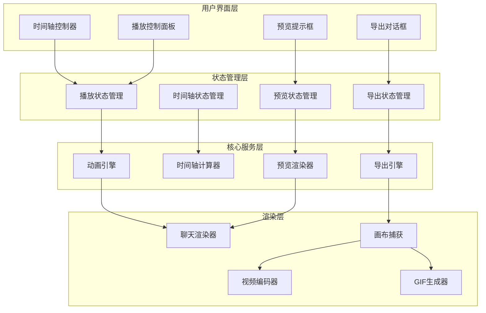

# 播放控制增强设计文档

## 概述

本设计文档描述了微信聊天模拟器播放控制系统的全面重构方案。基于现有的React + TypeScript架构，我们将重新设计播放控制、实时预览、进度管理和导出功能，解决当前系统中的性能问题和用户体验缺陷。

## 架构

### 系统架构图



### 核心设计原则

1. **状态分离**: 播放状态、预览状态、导出状态完全分离管理
2. **性能优先**: 使用虚拟化、防抖、Web Worker等技术保证流畅性
3. **模块化**: 每个功能模块独立，便于测试和维护
4. **响应式**: 支持不同屏幕尺寸和设备类型

## 组件和接口

### 1. 增强的时间轴控制器

```typescript
interface TimelineControlProps {
  totalDuration: number;
  currentTime: number;
  keyframes: Keyframe[];
  isPlaying: boolean;
  onSeek: (time: number) => void;
  onPreview: (time: number) => void;
  onKeyframeClick: (keyframe: Keyframe) => void;
}

interface Keyframe {
  id: string;
  time: number;
  messageIndex: number;
  type: 'message' | 'typing' | 'voice' | 'image' | 'recall';
  title: string;
  thumbnail?: string;
}

// 时间轴控制器组件
class TimelineControl extends React.Component<TimelineControlProps> {
  // 拖拽处理
  private handleDrag = (event: MouseEvent) => {
    const progress = this.calculateProgress(event.clientX);
    const time = progress * this.props.totalDuration;
    this.props.onSeek(time);
  };
  
  // 悬停预览
  private handleHover = (event: MouseEvent) => {
    const progress = this.calculateProgress(event.clientX);
    const time = progress * this.props.totalDuration;
    this.props.onPreview(time);
  };
  
  // 关键帧渲染
  private renderKeyframes = () => {
    return this.props.keyframes.map(keyframe => (
      <KeyframeMarker
        key={keyframe.id}
        keyframe={keyframe}
        position={keyframe.time / this.props.totalDuration}
        onClick={() => this.props.onKeyframeClick(keyframe)}
      />
    ));
  };
}
```

### 2. 播放状态管理系统

```typescript
interface PlaybackState {
  // 基础播放状态
  isPlaying: boolean;
  isPaused: boolean;
  currentTime: number;
  totalDuration: number;
  playbackSpeed: number;
  
  // 播放模式
  playMode: 'normal' | 'loop' | 'preview';
  
  // 消息状态
  currentMessageIndex: number;
  visibleMessages: Message[];
  
  // 滚动状态
  shouldAutoScroll: boolean;
  scrollPosition: number;
  
  // 历史记录
  history: PlaybackSnapshot[];
  historyIndex: number;
}

interface PlaybackSnapshot {
  timestamp: number;
  messageIndex: number;
  scrollPosition: number;
  playbackSpeed: number;
}

class PlaybackStateManager {
  private state: PlaybackState;
  private listeners: Set<(state: PlaybackState) => void> = new Set();
  
  // 播放控制
  public play(): void {
    this.updateState({
      isPlaying: true,
      isPaused: false
    });
    this.startAnimationLoop();
  }
  
  public pause(): void {
    this.updateState({
      isPlaying: false,
      isPaused: true
    });
    this.stopAnimationLoop();
  }
  
  // 跳转控制
  public seekToTime(time: number): void {
    const messageIndex = this.calculateMessageIndexFromTime(time);
    this.seekToMessage(messageIndex);
  }
  
  public seekToMessage(index: number): void {
    const visibleMessages = this.calculateVisibleMessages(index);
    const scrollPosition = this.calculateScrollPosition(index);
    
    this.updateState({
      currentMessageIndex: index,
      visibleMessages,
      scrollPosition,
      currentTime: this.calculateTimeFromMessageIndex(index)
    });
    
    this.saveSnapshot();
  }
  
  // 速度控制
  public setPlaybackSpeed(speed: number): void {
    this.updateState({ playbackSpeed: speed });
  }
  
  // 历史记录
  public undo(): void {
    if (this.state.historyIndex > 0) {
      const snapshot = this.state.history[this.state.historyIndex - 1];
      this.restoreSnapshot(snapshot);
      this.updateState({ historyIndex: this.state.historyIndex - 1 });
    }
  }
  
  public redo(): void {
    if (this.state.historyIndex < this.state.history.length - 1) {
      const snapshot = this.state.history[this.state.historyIndex + 1];
      this.restoreSnapshot(snapshot);
      this.updateState({ historyIndex: this.state.historyIndex + 1 });
    }
  }
}
```

### 3. 预览系统

```typescript
interface PreviewState {
  isActive: boolean;
  previewTime: number;
  previewMessageIndex: number;
  previewSnapshot: ChatSnapshot;
  tooltipPosition: { x: number; y: number };
}

interface ChatSnapshot {
  messages: Message[];
  scrollPosition: number;
  typingUsers: string[];
  messageStatuses: Map<string, MessageStatus>;
}

class PreviewRenderer {
  private previewCanvas: HTMLCanvasElement;
  private previewContext: CanvasRenderingContext2D;
  
  // 生成预览快照
  public generatePreview(time: number): Promise<ChatSnapshot> {
    const messageIndex = this.calculateMessageIndexFromTime(time);
    const messages = this.getVisibleMessagesAtIndex(messageIndex);
    const scrollPosition = this.calculateScrollPositionAtIndex(messageIndex);
    
    return {
      messages,
      scrollPosition,
      typingUsers: this.getTypingUsersAtIndex(messageIndex),
      messageStatuses: this.getMessageStatusesAtIndex(messageIndex)
    };
  }
  
  // 渲染预览缩略图
  public renderThumbnail(snapshot: ChatSnapshot): Promise<string> {
    return new Promise((resolve) => {
      // 在离屏canvas上渲染缩略图
      this.renderChatSnapshot(snapshot);
      const thumbnailDataUrl = this.previewCanvas.toDataURL('image/jpeg', 0.8);
      resolve(thumbnailDataUrl);
    });
  }
}
```

### 4. 导出引擎重构

```typescript
interface ExportConfig {
  format: 'gif' | 'mp4' | 'webm';
  quality: 'high' | 'medium' | 'low' | 'custom';
  resolution: { width: number; height: number };
  framerate: number;
  duration?: number;
  customSettings?: {
    bitrate?: number;
    compression?: number;
    colorDepth?: number;
  };
}

interface ExportProgress {
  phase: 'preparing' | 'capturing' | 'encoding' | 'finalizing';
  currentFrame: number;
  totalFrames: number;
  percentage: number;
  estimatedTimeRemaining: number;
  currentFileSize: number;
}

class ExportEngine {
  private worker: Worker;
  private progressCallback: (progress: ExportProgress) => void;
  
  constructor() {
    // 使用Web Worker进行导出处理
    this.worker = new Worker('/workers/export-worker.js');
    this.setupWorkerHandlers();
  }
  
  public async exportAnimation(
    messages: Message[],
    config: ExportConfig,
    onProgress: (progress: ExportProgress) => void
  ): Promise<Blob> {
    this.progressCallback = onProgress;
    
    // 计算总帧数
    const totalFrames = this.calculateTotalFrames(messages, config);
    
    // 开始导出流程
    return new Promise((resolve, reject) => {
      this.worker.postMessage({
        type: 'START_EXPORT',
        payload: { messages, config, totalFrames }
      });
      
      this.worker.onmessage = (event) => {
        const { type, payload } = event.data;
        
        switch (type) {
          case 'PROGRESS_UPDATE':
            this.progressCallback(payload);
            break;
          case 'EXPORT_COMPLETE':
            resolve(payload.blob);
            break;
          case 'EXPORT_ERROR':
            reject(new Error(payload.error));
            break;
        }
      };
    });
  }
  
  // 帧捕获优化
  private async captureFrame(messageIndex: number): Promise<ImageData> {
    // 使用OffscreenCanvas进行高效渲染
    const offscreenCanvas = new OffscreenCanvas(375, 667);
    const ctx = offscreenCanvas.getContext('2d');
    
    // 渲染当前状态
    await this.renderChatState(ctx, messageIndex);
    
    return ctx.getImageData(0, 0, 375, 667);
  }
}
```

### 5. 性能优化组件

```typescript
// 虚拟化消息列表
class VirtualizedMessageList extends React.Component {
  private containerRef = React.createRef<HTMLDivElement>();
  private visibleRange = { start: 0, end: 0 };
  
  // 计算可见范围
  private calculateVisibleRange(): { start: number; end: number } {
    const container = this.containerRef.current;
    if (!container) return { start: 0, end: 0 };
    
    const scrollTop = container.scrollTop;
    const containerHeight = container.clientHeight;
    const itemHeight = 60; // 平均消息高度
    
    const start = Math.floor(scrollTop / itemHeight);
    const end = Math.min(
      this.props.messages.length,
      Math.ceil((scrollTop + containerHeight) / itemHeight) + 1
    );
    
    return { start, end };
  }
  
  // 渲染可见消息
  private renderVisibleMessages(): React.ReactNode[] {
    const { start, end } = this.visibleRange;
    const visibleMessages = this.props.messages.slice(start, end);
    
    return visibleMessages.map((message, index) => (
      <MessageBubble
        key={start + index}
        message={message}
        index={start + index}
        style={{
          position: 'absolute',
          top: (start + index) * 60,
          width: '100%'
        }}
      />
    ));
  }
}

// 防抖处理器
class DebouncedHandler {
  private timeoutId: number | null = null;
  
  public debounce<T extends (...args: any[]) => void>(
    func: T,
    delay: number
  ): (...args: Parameters<T>) => void {
    return (...args: Parameters<T>) => {
      if (this.timeoutId) {
        clearTimeout(this.timeoutId);
      }
      
      this.timeoutId = window.setTimeout(() => {
        func(...args);
        this.timeoutId = null;
      }, delay);
    };
  }
}
```

## 数据模型

### 增强的播放状态模型

```typescript
interface EnhancedPlaybackState {
  // 基础状态
  playback: {
    isPlaying: boolean;
    currentTime: number;
    totalDuration: number;
    playbackSpeed: number;
    playMode: 'normal' | 'loop' | 'preview';
  };
  
  // 消息状态
  messages: {
    currentIndex: number;
    visibleIndices: number[];
    totalCount: number;
    keyframes: Keyframe[];
  };
  
  // 视图状态
  viewport: {
    scrollPosition: number;
    shouldAutoScroll: boolean;
    visibleRange: { start: number; end: number };
  };
  
  // 预览状态
  preview: {
    isActive: boolean;
    time: number;
    messageIndex: number;
    thumbnail: string | null;
  };
  
  // 导出状态
  export: {
    isExporting: boolean;
    progress: ExportProgress;
    config: ExportConfig;
    history: ExportHistoryItem[];
  };
  
  // 性能监控
  performance: {
    fps: number;
    memoryUsage: number;
    renderTime: number;
  };
}
```

### 时间轴计算模型

```typescript
interface TimelineData {
  totalDuration: number;
  segments: TimelineSegment[];
  keyframes: Keyframe[];
  markers: TimelineMarker[];
}

interface TimelineSegment {
  startTime: number;
  endTime: number;
  messageIndex: number;
  type: 'message' | 'pause' | 'typing' | 'animation';
  duration: number;
  metadata: {
    speaker?: string;
    content?: string;
    animationType?: string;
  };
}

interface TimelineMarker {
  time: number;
  type: 'chapter' | 'bookmark' | 'error' | 'highlight';
  label: string;
  color: string;
}
```

## 错误处理

### 错误类型定义

```typescript
enum PlaybackErrorType {
  ANIMATION_FAILED = 'ANIMATION_FAILED',
  SEEK_FAILED = 'SEEK_FAILED',
  EXPORT_FAILED = 'EXPORT_FAILED',
  PREVIEW_FAILED = 'PREVIEW_FAILED',
  PERFORMANCE_DEGRADED = 'PERFORMANCE_DEGRADED'
}

interface PlaybackError {
  type: PlaybackErrorType;
  message: string;
  timestamp: number;
  context: {
    messageIndex?: number;
    playbackSpeed?: number;
    memoryUsage?: number;
  };
  recoveryAction?: () => void;
}
```

### 错误恢复策略

```typescript
class ErrorRecoveryManager {
  // 动画失败恢复
  public handleAnimationFailure(error: PlaybackError): void {
    // 降级到简化动画模式
    this.enableFallbackMode();
    // 重试当前操作
    this.retryCurrentOperation();
  }
  
  // 性能降级处理
  public handlePerformanceDegradation(): void {
    // 减少动画复杂度
    this.reduceAnimationComplexity();
    // 启用虚拟化
    this.enableVirtualization();
    // 降低渲染质量
    this.reducerRenderQuality();
  }
  
  // 导出失败恢复
  public handleExportFailure(error: PlaybackError): void {
    // 清理临时文件
    this.cleanupTempFiles();
    // 释放内存
    this.freeMemory();
    // 提供重试选项
    this.offerRetryOptions();
  }
}
```

## 测试策略

### 单元测试

```typescript
describe('PlaybackStateManager', () => {
  let manager: PlaybackStateManager;
  
  beforeEach(() => {
    manager = new PlaybackStateManager();
  });
  
  it('should handle play/pause correctly', () => {
    manager.play();
    expect(manager.getState().isPlaying).toBe(true);
    
    manager.pause();
    expect(manager.getState().isPlaying).toBe(false);
    expect(manager.getState().isPaused).toBe(true);
  });
  
  it('should seek to correct position', () => {
    const targetTime = 5000; // 5秒
    manager.seekToTime(targetTime);
    
    expect(manager.getState().currentTime).toBe(targetTime);
  });
});

describe('TimelineControl', () => {
  it('should calculate progress correctly', () => {
    const control = new TimelineControl({
      totalDuration: 10000,
      currentTime: 5000,
      // ... other props
    });
    
    expect(control.calculateProgress()).toBe(0.5);
  });
});
```

### 集成测试

```typescript
describe('Playback Integration', () => {
  it('should sync timeline with chat display', async () => {
    const { timeline, chatInterface } = renderPlaybackSystem();
    
    // 拖拽时间轴
    fireEvent.drag(timeline.progressBar, { clientX: 200 });
    
    // 验证聊天界面更新
    await waitFor(() => {
      expect(chatInterface.currentMessageIndex).toBe(5);
    });
  });
  
  it('should export GIF correctly', async () => {
    const { exportButton } = renderPlaybackSystem();
    
    fireEvent.click(exportButton);
    
    await waitFor(() => {
      expect(mockExportEngine.exportToGif).toHaveBeenCalled();
    }, { timeout: 10000 });
  });
});
```

### 性能测试

```typescript
describe('Performance Tests', () => {
  it('should maintain 60fps during playback', async () => {
    const performanceMonitor = new PerformanceMonitor();
    const playbackSystem = new PlaybackSystem();
    
    performanceMonitor.start();
    playbackSystem.play();
    
    await new Promise(resolve => setTimeout(resolve, 5000));
    
    const avgFps = performanceMonitor.getAverageFPS();
    expect(avgFps).toBeGreaterThan(55); // 允许5fps的误差
  });
  
  it('should handle large message lists efficiently', () => {
    const largeMessageList = generateMessages(1000);
    const virtualizedList = new VirtualizedMessageList({
      messages: largeMessageList
    });
    
    const renderTime = measureRenderTime(() => {
      virtualizedList.render();
    });
    
    expect(renderTime).toBeLessThan(16); // 16ms = 60fps
  });
});
```

## 实现优先级

### 第一阶段（核心功能重构）
1. 播放状态管理系统重构
2. 交互式进度控制实现
3. 播放模式与预览模式区分
4. 基础性能优化

### 第二阶段（预览和导出增强）
1. 实时预览系统实现
2. 时间轴可视化组件
3. 导出引擎重构
4. 错误处理和恢复机制

### 第三阶段（高级功能）
1. 虚拟化和性能优化
2. 协作功能支持
3. 配置管理系统
4. 深度定制选项

## 性能基准

### 目标指标
- 播放帧率: ≥ 60 FPS
- 拖拽响应时间: ≤ 16ms
- 预览生成时间: ≤ 100ms
- 内存使用: ≤ 500MB（1000条消息）
- GIF导出时间: ≤ 30秒（100帧）
- 首次渲染时间: ≤ 200ms

### 监控指标
- 实时FPS监控
- 内存使用跟踪
- 渲染时间分析
- 用户交互延迟测量
- 导出成功率统计

## 风险和缓解措施

### 技术风险

1. **性能瓶颈**: 复杂动画可能导致卡顿
   - 缓解: 使用Web Worker、虚拟化、帧率自适应

2. **内存泄漏**: 大量DOM操作可能导致内存问题
   - 缓解: 及时清理、对象池、弱引用

3. **浏览器兼容性**: 某些API可能不兼容
   - 缓解: 特性检测、polyfill、降级方案

### 用户体验风险

1. **操作复杂度**: 功能过多可能影响易用性
   - 缓解: 渐进式披露、智能默认值、用户引导

2. **导出质量**: 不同设备导出效果可能不一致
   - 缓解: 标准化渲染、质量预设、预览功能

## 总结

本设计方案通过全面重构播放控制系统，解决了当前系统中的关键问题：

1. **交互性**: 实现了真正的交互式进度控制和实时预览
2. **性能**: 通过虚拟化、Web Worker等技术保证流畅体验
3. **可靠性**: 完善的错误处理和恢复机制
4. **扩展性**: 模块化设计便于后续功能扩展

重点解决了播放模式与预览模式的区分问题，确保播放时消息逐条出现并自动滚动，预览时显示完整内容，为用户提供专业级的动画制作体验。