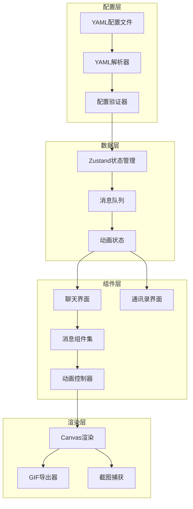

# 设计文档

## 概述

本设计文档描述了微信对话生成器的增强功能实现方案。基于现有的React + TypeScript架构，我们将扩展系统以支持语音消息、图片消息、消息状态、高级动画控制等功能，实现电影级的聊天故事动画效果。

## 架构

### 系统架构图



### 技术栈

- **前端框架**: React 18.3 + TypeScript
- **状态管理**: Zustand
- **样式**: TailwindCSS
- **动画**: CSS Animations + React Spring (新增)
- **图片处理**: Canvas API
- **GIF生成**: gif.js
- **构建工具**: Vite

## 组件和接口

### 1. 消息类型扩展

```typescript
// 扩展现有的Message接口
interface Message {
  // 现有字段
  speaker?: string;
  content?: string;
  time?: string;
  type?: 'message' | 'pause' | 'typing' | 'location' | 'voice' | 'image' | 'recall';
  
  // 新增字段
  voiceDuration?: string;           // 语音时长 "10""
  voiceText?: string;                // 语音转文字内容
  imageUrl?: string | string[];      // 图片URL（支持多图）
  imageDescription?: string;         // 图片描述
  status?: 'sending' | 'sent' | 'read'; // 消息状态
  statusDuration?: 'short' | 'medium' | 'long'; // 状态持续时间
  animationDelay?: 'short' | 'medium' | 'long'; // 动画延迟
  recalled?: boolean;                // 是否被撤回
  recallDelay?: 'short' | 'medium' | 'long'; // 撤回延迟
}
```

### 2. 新增组件

#### VoiceMessage组件
```typescript
interface VoiceMessageProps {
  message: Message;
  participant: Participant | null;
  isCurrentUser: boolean;
  isPlaying?: boolean;
}

// 功能：
// - 显示绿色语音条和时长
// - 语音转文字渐显动画
// - 未播放红点提示
```

#### ImageMessage组件
```typescript
interface ImageMessageProps {
  message: Message;
  participant: Participant | null;
  isCurrentUser: boolean;
}

// 功能：
// - 图片缩略图显示
// - 多图拼接布局
// - 渐显加载动画
```

#### MessageStatus组件
```typescript
interface MessageStatusProps {
  status: 'sending' | 'sent' | 'read';
  duration: 'short' | 'medium' | 'long';
}

// 功能：
// - 发送中转圈动画
// - 状态平滑过渡
```

#### RecallMessage组件
```typescript
interface RecallMessageProps {
  originalMessage: Message;
  showReEdit?: boolean;
}

// 功能：
// - 消息消失动画
// - 系统提示显示
```

#### ContactListView组件
```typescript
interface ContactListViewProps {
  contacts: Contact[];
  onSelectContact: (contact: Contact) => void;
}

// 功能：
// - 通讯录列表展示
// - 搜索功能
// - 切换动画
```

### 3. 动画控制系统

```typescript
interface AnimationController {
  // 时间控制
  setGlobalSpeed(multiplier: number): void;
  getDelayMs(delay: 'short' | 'medium' | 'long'): number;
  
  // 动画队列
  queueAnimation(animation: Animation): void;
  playAnimations(): Promise<void>;
  pauseAnimations(): void;
  
  // 特效控制
  enableTextReveal(enabled: boolean): void;
  enableFocusEffect(messageId: string): void;
  enableBlurBackground(enabled: boolean): void;
}

interface Animation {
  type: 'message' | 'typing' | 'status' | 'recall' | 'scene';
  target: string;
  duration: number;
  delay: number;
  easing?: string;
}
```

### 4. 增强的YAML解析器

```typescript
interface EnhancedYamlParser {
  parse(yaml: string): ChatData;
  validate(data: ChatData): ValidationResult;
  applyTemplate(template: SceneTemplate): ChatData;
  
  // 时间转换
  convertDelay(delay: string): 'short' | 'medium' | 'long';
  convertDuration(duration: string): number;
}

interface SceneTemplate {
  name: string;
  description: string;
  defaultParticipants: Participant[];
  messageTemplates: Message[];
  animationPreset: AnimationPreset;
}
```

## 数据模型

### 扩展的ChatData模型

```typescript
interface ChatData {
  scene: ChatScene;
  messages: Message[];
  
  // 新增字段
  animationConfig?: {
    globalSpeed: number;
    defaultDelay: 'short' | 'medium' | 'long';
    enableEffects: {
      textReveal: boolean;
      focusEffect: boolean;
      blurBackground: boolean;
    };
  };
  
  theme?: {
    primaryColor: string;
    backgroundColor: string;
    fontFamily?: string;
  };
}
```

### 状态管理扩展

```typescript
interface AnimationStore {
  // 现有状态
  currentMessageIndex: number;
  isPlaying: boolean;
  
  // 新增状态
  currentScene: 'contact' | 'chat';
  typingUsers: string[];
  messageStatuses: Map<string, MessageStatus>;
  recalledMessages: Set<string>;
  
  // 动作
  switchScene(scene: 'contact' | 'chat'): void;
  updateMessageStatus(messageId: string, status: MessageStatus): void;
  recallMessage(messageId: string): void;
  setTypingUsers(users: string[]): void;
}
```

## 错误处理

### 错误类型

```typescript
enum ErrorType {
  INVALID_YAML = 'INVALID_YAML',
  UNSUPPORTED_MESSAGE_TYPE = 'UNSUPPORTED_MESSAGE_TYPE',
  ANIMATION_FAILED = 'ANIMATION_FAILED',
  EXPORT_FAILED = 'EXPORT_FAILED',
  RESOURCE_NOT_FOUND = 'RESOURCE_NOT_FOUND'
}

interface ErrorHandler {
  handleError(error: Error, type: ErrorType): void;
  showUserMessage(message: string, severity: 'info' | 'warning' | 'error'): void;
  logError(error: Error, context?: any): void;
}
```

### 错误恢复策略

1. **配置错误**: 提供默认值，显示警告
2. **动画错误**: 跳过失败的动画，继续播放
3. **资源加载失败**: 显示占位符，重试机制
4. **导出错误**: 保存部分结果，提供重试选项

## 测试策略

### 单元测试

```typescript
// 组件测试示例
describe('VoiceMessage', () => {
  it('should display voice duration correctly', () => {
    const message = { type: 'voice', voiceDuration: '10"' };
    const component = render(<VoiceMessage message={message} />);
    expect(component.getByText('10"')).toBeInTheDocument();
  });
  
  it('should show red dot for unplayed voice', () => {
    const message = { type: 'voice', played: false };
    const component = render(<VoiceMessage message={message} />);
    expect(component.getByTestId('unplayed-dot')).toBeVisible();
  });
});
```

### 集成测试

1. **动画流程测试**: 验证完整的动画序列
2. **YAML解析测试**: 测试各种配置场景
3. **导出功能测试**: 验证GIF生成质量
4. **性能测试**: 确保动画流畅度

### 性能基准

- 动画帧率: ≥ 30 FPS
- GIF导出时间: < 10秒（100帧）
- 内存使用: < 200MB
- 配置解析时间: < 100ms

## 实现优先级

### 第一阶段（核心功能）
1. 语音消息组件
2. 图片消息组件
3. 消息状态显示
4. 基础动画时间控制

### 第二阶段（增强功能）
1. 输入状态增强
2. 消息撤回效果
3. 高级动画控制
4. YAML配置增强

### 第三阶段（高级功能）
1. 场景切换支持
2. 导出功能优化
3. 实时预览增强
4. 场景模板系统

## 配置示例

```yaml
scene:
  title: "表白时刻"
  theme:
    primaryColor: "#95EC69"
  animation:
    globalSpeed: 1.0
    defaultDelay: medium
    
participants:
  - name: "许阳"
    avatar: "xu_yang.jpg"
  - name: "小宁"
    avatar: "xiao_ning.jpg"

messages:
  # 文字消息
  - speaker: "许阳"
    content: "我是许阳，今天大头告诉我一些17年前的事"
    time: "21:30"
    status: sent
    statusDuration: short
    
  # 输入状态
  - type: typing
    speaker: "小宁"
    duration: long
    hesitate: true  # 输入-停止-再输入效果
    
  # 语音消息
  - type: voice
    speaker: "小宁"
    voiceDuration: "15""
    voiceText: "许阳...你知道吗？那天给你纸条之后，我后悔了整整17年。"
    time: "21:35"
    
  # 图片消息
  - type: image
    speaker: "许阳"
    imageUrl: ["heart_left.jpg", "heart_right.jpg"]
    imageDescription: "两张纸拼成的心"
    time: "21:33"
    animationDelay: medium
    
  # 消息撤回
  - type: recall
    originalMessage: "在吗"
    recallDelay: short
```

## 风险和缓解措施

### 技术风险

1. **性能问题**: 复杂动画可能导致卡顿
   - 缓解: 使用requestAnimationFrame，优化渲染循环

2. **浏览器兼容性**: 某些CSS动画可能不兼容
   - 缓解: 提供降级方案，使用polyfill

3. **内存泄漏**: 大量图片和动画可能导致内存问题
   - 缓解: 及时清理未使用资源，使用虚拟滚动

### 用户体验风险

1. **配置复杂度**: YAML配置可能过于复杂
   - 缓解: 提供可视化配置界面，模板系统

2. **导出质量**: GIF可能无法完美还原动画
   - 缓解: 优化帧率和压缩算法，提供多种导出格式

## 总结

本设计方案在现有基础上进行渐进式增强，保持了系统的稳定性和可维护性。通过模块化的组件设计和清晰的接口定义，确保新功能可以平滑集成。重点关注了用户体验和性能优化，为创作者提供强大而易用的工具。