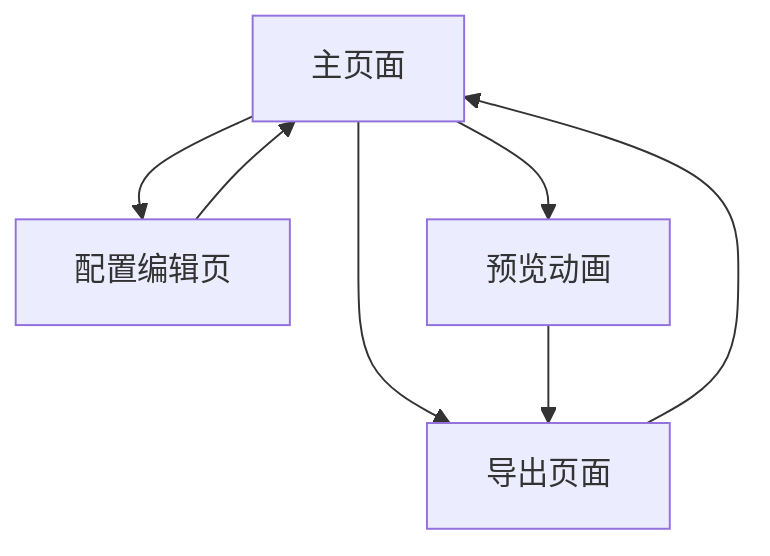

# 微信聊天模拟器产品需求文档

## 1. Product Overview

微信聊天模拟器是一个高度还原微信聊天界面的网页工具，用于生成逼真的微信对话动图。
- 该工具通过YAML配置文件驱动，能够模拟真实的微信聊天场景，包括消息发送动画、打字状态、暂停等待等交互效果。
- 主要面向内容创作者、营销人员和教育工作者，用于制作演示材料、教学案例或营销素材。

## 2. Core Features

### 2.1 Feature Module

我们的微信聊天模拟器包含以下主要页面：
1. **主页面**：聊天界面展示区、配置面板、预览控制。
2. **配置编辑页**：YAML编辑器、参与者设置、消息序列编辑。
3. **导出页面**：动画预览、导出设置、格式选择。

### 2.2 Page Details

| Page Name | Module Name | Feature description |
|-----------|-------------|---------------------|
| 主页面 | 聊天界面展示区 | 完全复刻微信聊天UI，包括聊天背景、消息气泡样式、时间戳显示、头像和昵称位置 |
| 主页面 | 配置面板 | 提供参与者头像上传、昵称设置、快速消息添加功能 |
| 主页面 | 预览控制 | 播放/暂停动画、调整播放速度、重置到开始状态 |
| 配置编辑页 | YAML编辑器 | 支持直接编辑YAML配置文件，实时语法检查和错误提示 |
| 配置编辑页 | 参与者设置 | 管理对话参与者信息，包括姓名、头像、角色设定 |
| 配置编辑页 | 消息序列编辑 | 可视化编辑消息序列，支持文字消息、表情、位置、打字状态、暂停等类型 |
| 导出页面 | 动画预览 | 最终效果预览，支持全屏模式和不同设备尺寸预览 |
| 导出页面 | 导出设置 | 配置导出参数，包括分辨率、帧率、压缩质量等 |
| 导出页面 | 格式选择 | 支持导出为GIF、MP4视频格式，提供不同质量选项 |

## 3. Core Process

**主要用户操作流程：**

用户首先在主页面查看默认的聊天界面，然后通过配置面板快速设置参与者信息和添加基础消息。对于复杂的对话场景，用户可以进入配置编辑页面，使用YAML编辑器精确控制消息序列、时间间隔和特殊效果。配置完成后，用户在主页面预览动画效果，调整播放参数。最后进入导出页面，选择合适的格式和质量设置，生成最终的动图或视频文件。

## 4. User Interface Design

### 4.1 Design Style

- **主色调**：微信绿色(#07C160)作为主色，浅灰色(#F7F7F7)作为背景色
- **按钮样式**：圆角按钮，遵循微信设计语言，支持悬停和点击状态
- **字体**：系统默认字体，消息内容使用14px，界面文字使用12px
- **布局风格**：左右分栏布局，左侧为聊天界面，右侧为配置面板
- **图标风格**：使用简洁的线性图标，与微信风格保持一致

### 4.2 Page Design Overview

| Page Name | Module Name | UI Elements |
|-----------|-------------|-------------|
| 主页面 | 聊天界面展示区 | 微信绿色顶部导航栏，浅灰色聊天背景，白色/绿色消息气泡，圆形头像，时间戳居中显示 |
| 主页面 | 配置面板 | 白色背景面板，分组的配置选项，文件上传区域，实时预览缩略图 |
| 主页面 | 预览控制 | 底部固定的播放控制条，包含播放/暂停按钮、进度条、速度调节滑块 |
| 配置编辑页 | YAML编辑器 | 深色主题代码编辑器，语法高亮，行号显示，错误标记 |
| 配置编辑页 | 参与者设置 | 卡片式布局，头像预览，表单输入框，添加/删除按钮 |
| 导出页面 | 动画预览 | 全屏预览模式，设备框架选择，缩放控制 |
| 导出页面 | 导出设置 | 选项卡式设置面板，滑块控件，下拉选择框，进度指示器 |

### 4.3 Responsiveness

产品采用桌面优先的响应式设计，在移动设备上自动调整为上下布局。针对触屏设备优化了按钮大小和交互区域，确保在不同屏幕尺寸下都能提供良好的用户体验。