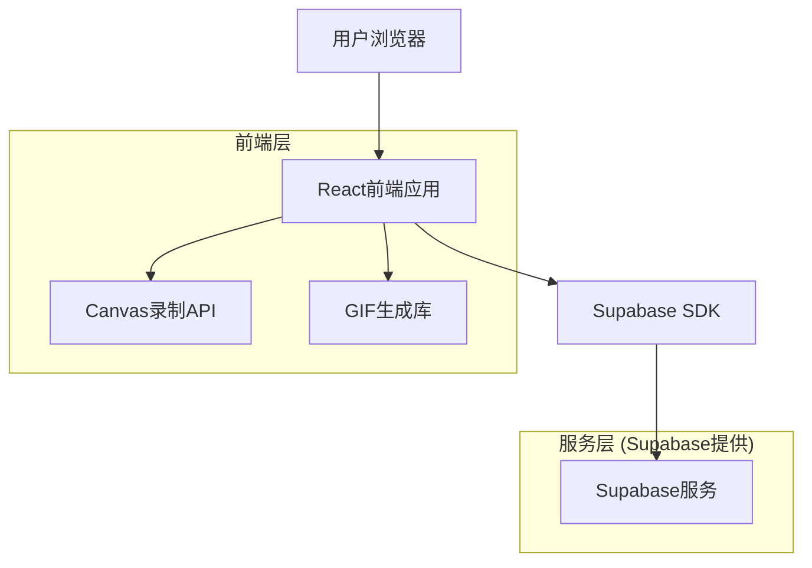
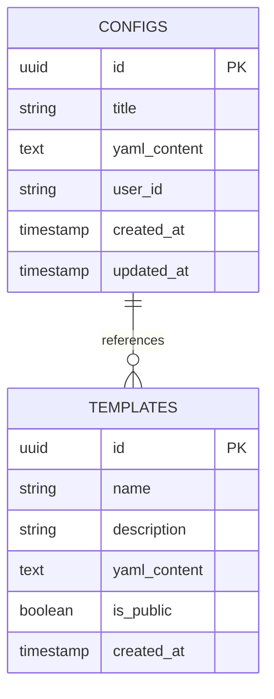

# 微信聊天模拟器技术架构文档

## 1. Architecture design



## 2. Technology Description

- Frontend: React@18 + TypeScript + Tailwind CSS + Vite
- Backend: Supabase (用户配置存储)
- 动画录制: html2canvas + gif.js
- 状态管理: Zustand
- YAML解析: js-yaml

## 3. Route definitions

| Route | Purpose |
|-------|---------|
| / | 主页面，包含聊天界面展示和配置面板 |
| /editor | 配置编辑页面，提供YAML编辑器和高级设置 |
| /export | 导出页面，动画预览和格式选择 |
| /templates | 模板库页面，预设的对话模板 |

## 4. API definitions

### 4.1 Core API

配置保存相关
```
POST /api/configs
```

Request:
| Param Name | Param Type | isRequired | Description |
|------------|------------|------------|-------------|
| title | string | true | 配置标题 |
| yaml_content | string | true | YAML配置内容 |
| user_id | string | false | 用户ID（可选） |

Response:
| Param Name | Param Type | Description |
|------------|------------|-------------|
| id | string | 配置ID |
| created_at | string | 创建时间 |

配置获取
```
GET /api/configs/:id
```

Response:
| Param Name | Param Type | Description |
|------------|------------|-------------|
| title | string | 配置标题 |
| yaml_content | string | YAML配置内容 |
| updated_at | string | 更新时间 |

## 5. Data model

### 5.1 Data model definition



### 5.2 Data Definition Language

配置表 (configs)
```sql
-- 创建配置表
CREATE TABLE configs (
    id UUID PRIMARY KEY DEFAULT gen_random_uuid(),
    title VARCHAR(255) NOT NULL,
    yaml_content TEXT NOT NULL,
    user_id VARCHAR(255),
    created_at TIMESTAMP WITH TIME ZONE DEFAULT NOW(),
    updated_at TIMESTAMP WITH TIME ZONE DEFAULT NOW()
);

-- 创建模板表
CREATE TABLE templates (
    id UUID PRIMARY KEY DEFAULT gen_random_uuid(),
    name VARCHAR(255) NOT NULL,
    description TEXT,
    yaml_content TEXT NOT NULL,
    is_public BOOLEAN DEFAULT false,
    created_at TIMESTAMP WITH TIME ZONE DEFAULT NOW()
);

-- 创建索引
CREATE INDEX idx_configs_user_id ON configs(user_id);
CREATE INDEX idx_configs_created_at ON configs(created_at DESC);
CREATE INDEX idx_templates_public ON templates(is_public);

-- 权限设置
GRANT SELECT ON configs TO anon;
GRANT ALL PRIVILEGES ON configs TO authenticated;
GRANT SELECT ON templates TO anon;
GRANT ALL PRIVILEGES ON templates TO authenticated;

-- 初始化模板数据
INSERT INTO templates (name, description, yaml_content, is_public) VALUES
('朋友聊天', '简单的朋友间对话模板', '# 对话场景配置\nscene:\n  title: "朋友间的对话"\n  participants:\n    - name: "小明"\n      avatar: "avatar1.jpg"\n    - name: "小红"\n      avatar: "avatar2.jpg"\n\n# 对话内容\nmessages:\n  - speaker: "小明"\n    content: "你好！"\n    time: "10:30"\n  - speaker: "小红"\n    content: "你好，最近怎么样？"\n    time: "10:31"', true),
('商务洽谈', '商务场景对话模板', '# 对话场景配置\nscene:\n  title: "商务洽谈"\n  participants:\n    - name: "张经理"\n      avatar: "manager.jpg"\n    - name: "李总"\n      avatar: "boss.jpg"\n\n# 对话内容\nmessages:\n  - speaker: "张经理"\n    content: "李总，关于这个项目的合作..."\n    time: "14:30"\n  - type: "typing"\n    speaker: "李总"\n    duration: "3秒"\n  - speaker: "李总"\n    content: "我们可以详细讨论一下"\n    time: "14:31"', true);
```